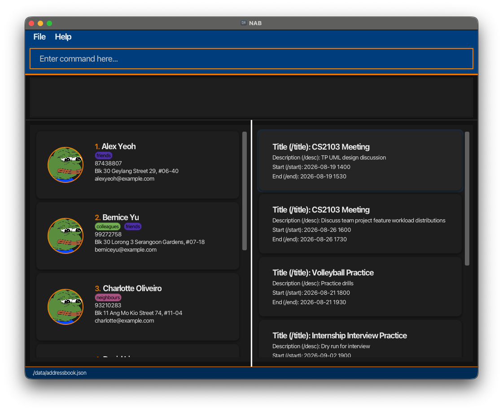
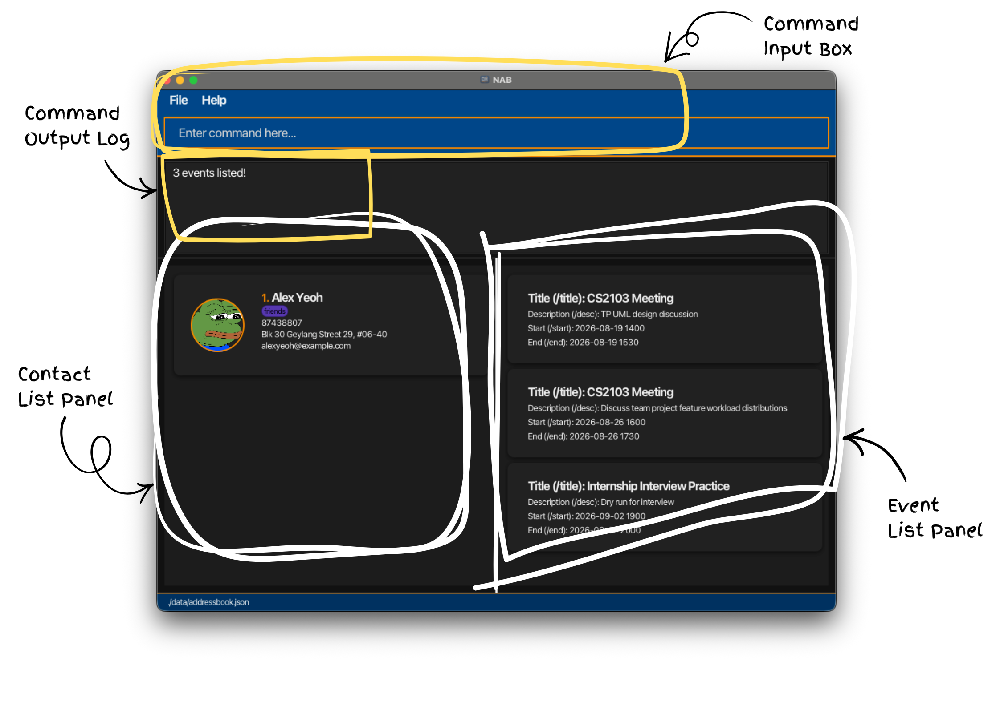
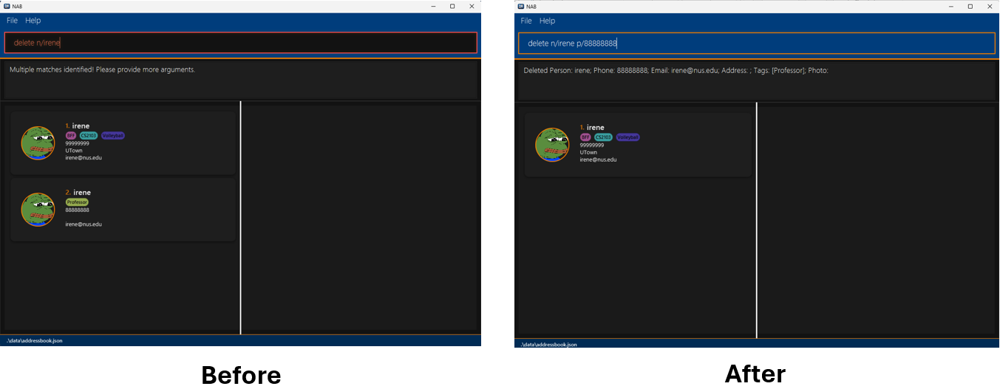

# NAB User Guide

___All your NUS connections, right at your fingertips___

NUS Address Book (NAB) is a desktop application built for **NUS students** to manage contacts across multiple modules, project groups, and CCAs with ease.
It is **optimized for use** via a Command Line Interface (CLI) while still having the benefits of a **Graphical User Interface (GUI)**. 
If you can type fast, NAB can help you organize and retrieve context-specific contacts and track events faster than traditional GUI apps.

Here is how NAB can **make student networking easier**: 
- Store and edit contact cards for your friends
- Helps track events tied to contacts
- Make bulk organisation easier with tags

<!-- * Table of Contents -->
<page-nav-print />

---

## Navigating this User Guide

This section provides a quick overview of how this guide is structured, so you can easily find the information you need and understand the notation used throughout.

### Who is this guide for?
This guide is for NUS students who want to use NAB to manage contacts and related events efficiently.

Whether you are new to NAB or just looking for a specific command, this guide is organised to help you find what you need quickly.

|                 Looking to...                  |                Head to...                |
|:----------------------------------------------:|:----------------------------------------:|
|         Set up NAB for the first time          |     **[Quick Start](#quick-start)**      |
|      Check command syntax and usage rules      |        **[Features](#features)**         |
|     Find a command quickly while using NAB     | **[Command summary](#command-summary)**  |
| Understand the comprehensive technical details | **[Developer Guide](DeveloperGuide.md)** |
### Conventions used
This guide uses **callout boxes** to help you quickly identify different types of information:

<box type="info" icon=":fa-solid-code:">

This **blue box** with the **code mark icon** provides you with **example commands** that demonstrate how a feature works.

</box>

<box type="important" icon=":fa-solid-exclamation-triangle:">

This **red box** with the **exclamation triangle icon** draws your attention to **warnings, important notes or limitations**

</box>

<box theme="success" icon=":fa-solid-lightbulb:">

This **green box** with a **lightbulb icon** highlights **helpful tips** for using NAB more effectively.

</box>

--------------------------------------------------------------------------------------------------------------------

# Quick Start

1. Ensure you have Java `17` or above installed on your computer. 
   **Mac users:** Ensure you have the precise JDK version prescribed [here](https://se-education.org/guides/tutorials/javaInstallationMac.html).

2. Download the latest `.jar` file from [here](https://github.com/AY2526S2-CS2103-F08-4/tp/releases).

3. Copy the file to the folder you want to use as the _home folder_ for your AddressBook.

4. Open a command terminal, `cd` into the folder you put the jar file in, and use the `java -jar NAB.jar` command to run the application.  
   A GUI similar to the below should appear in a few seconds. Note how the app contains some sample data. 
   

5. Type the command in the command box and press Enter to execute it.   e.g. typing **`help`** and pressing Enter will open the help window. 

    Some example commands you can try:

   * `list` : Lists all contacts.

   * `add n/John Doe p/98765432 e/johnd@example.com a/John street, block 123, #01-01` : Adds a contact named `John Doe` to the address book.

   * `delete n/John Doe` : Deletes a contact with name 'John Doe' from the address book.

   * `clear` : Deletes all contacts.

   * `exit` : Exits the app.

6. Refer to the [Features](#features) below for details of each command.

<panel header=":fa-solid-book: **Understanding the GUI**" type="secondary" expanded>

The labelled interface below highlights the main parts of NAB's GUI.

* **Command input box**: where you type commands.
* **Command output box**: shows feedback after each command is executed.
* **Person list panel**: displays the contacts currently shown.
* **Event list panel**: displays events related to the current context, such as a selected or uniquely matched person.

</panel>

--------------------------------------------------------------------------------------------------------------------

# Features

<box type="info" seamless>

**Notes about the command format:** 

* Words in `UPPER_CASE` are the parameters to be supplied by the user. 
  e.g. in `add n/NAME`, `NAME` is a parameter which can be used as `add n/John Doe`.

* Items in square brackets are optional. 
  e.g `n/NAME [t/TAG]` can be used as `n/John Doe t/friend` or as `n/John Doe`.

* Items with `...` after them can be used multiple times including zero times. 
  e.g. `[t/TAG]...` can be used as ` ` (i.e. 0 times), `t/friend`, `t/friend t/family` etc.

* Parameters can be in any order. 
  e.g. if the command specifies `n/NAME p/PHONE_NUMBER`, `p/PHONE_NUMBER n/NAME` is also acceptable.

* Extraneous parameters for commands that do not take in parameters (such as `help`, `list`, `exit` and `clear`) will be ignored. 
  e.g. if the command specifies `help 123`, it will be interpreted as `help`.

* Tags are case-insensitive. t/Friends and t/friends are treated as 1 unique tag. Multiple use of the same tags with different case sensitivity should not be used.
e.g `find n/John Doe t/Friends t/friends`

* If you are using a PDF version of this document, be careful when copying and pasting commands that span multiple lines as space characters surrounding line-breaks may be omitted when copied over to the application.

</box>

## Quick utilities

### Navigating command history

NAB keeps track of the commands you have entered, making it easier to reuse previous commands without typing them again.

This feature allows you to use **arrow keys** while in the command box to navigate through previously entered commands for the current session.

* Press ↑ to go back to older commands.
* Press ↓ to go forward to more recent commands.
* Pressing ↓ past the most recent history entry restores the text you were typing before you started navigating.
* Command history is session-only and is not saved after you exit NAB.

### Copying a Contact's Information

NAB allows you to copy a contact’s information, making it easier to reuse their details without typing them out manually.
A double-click on a person's contact copies their information to your clipboard.

This feature allows you to copy the displayed information of a contact for use outside NAB.

The copied text includes the following fields (optional fields that are not present are omitted):
- Name
- Phone number
- Tags
- Address
- Email

Each field is placed on a separate line.

### Viewing help: `help`

NAB provides quick access to both the online and offline versions of the User Guide, allowing you to refer to it whenever you need guidance on NAB’s features and commands.

This feature displays a message explaining how to access the online and offline help pages.

Format: `help`

### Exiting the program: `exit`

When it is time to say goodbye, NAB will not make it awkward.

This feature closes the program and ends the current session.

Format: `exit`

## Contact Management

### Parameters constraints & format

Before examining the individual commands for managing contacts, please refer to the formatting requirements and constraints for each parameter. Unless stated otherwise, ensure all inputs adhere to the rules stated in this section

<panel header=":fa-solid-book: **Parameters Requirements and Constraints**" type="secondary" expanded no-close>

| Parameter | Format | Example |
|-----------|--------|---------|
| `n/NAME` | • Must contain only alphabetic characters and spaces. • Cannot be blank or start with a space (the first character must be a letter). | `n/John Doe` |
| `p/PHONE_NUMBER` | • Must contain strictly numbers. • Must be between 7 and 15 digits long. | `p/98765432` |
| `e/EMAIL` | • Must be of the standard format: `local-part@domain`. • **Local-part:** Can only contain alphanumeric characters and the special characters `+`, `_`, `.`, and `-`. It cannot start or end with a special character. • **Domain:** Made up of domain labels separated by periods (`.`). &nbsp;&nbsp;◦ Must end with a domain label at least 2 characters long. &nbsp;&nbsp;◦ Each label must start and end with alphanumeric characters. &nbsp;&nbsp;◦ Labels can contain hyphens (`-`), but no other special characters. | `e/johnd@example.com` |
| `a/ADDRESS` | • Can contain alphanumeric characters, spaces, and the following special characters: `#`, `_`, `,` (comma), and `-` (hyphen). • Cannot be blank or consist only of spaces (must start with an alphanumeric or allowed special character). | `a/John street, block 123, #01-01` |
| `t/TAG` | • Can contain letters, digits, spaces, hyphens (`-`), and underscores (`_`). • Must start with an alphanumeric character (a letter or digit). • Must be between 1 and 20 characters long. | `t/friend` |
| `pfp/PHOTO_PATH` | • File path must end with a valid image extension: `.png`, `.jpg`, or `.jpeg` (case-insensitive). • Can be absolute (e.g., `C:/Users/Alex/Pictures/me.jpg`) or relative to the app folder (e.g., `images/me.png`). • The specified file must exist on your computer. | `pfp/images/me.png` |

</panel>

<box type="info" seamless>

**Managing Profile Pictures**

When using the `pfp/PHOTO_PATH` parameter in commands like `add` and `edit`, please note:
* Accepted file extensions are `.png`, `.jpg`, and `.jpeg`.
* `PHOTO_PATH` can be absolute (e.g., `C:/Users/Alex/Pictures/me.jpg`) or relative to the app folder (e.g., `images/me.png`).
* The specified file must exist on your computer; NAB will copy it into the `data/images/` directory.
</box>

### User Disambiguation

Commands in NAB identify a contact by name. If two or more contacts share the same name,
NAB cannot determine which one you meant, and will display the following error:
<box type="important" icon=":fa-solid-exclamation-triangle:">

**ERROR MESSAGE**  
`Multiple matches identified! Please provide more information to narrow down the contact.`  
This error means your command matched more than one contact. No changes have been made —
retry the command with additional details to uniquely identify the contact you want.

</box>

<panel header=":fa-solid-book: **Disambiguate with Optional Parameters**" type="secondary" expanded no-close>

Add one or more optional parameters **immediately after `n/NAME`** (or after `to/NAME` for `event add`)
to narrow the match down to a single contact.

| Parameter | Prefix | Example               |
|-----------|--------|-----------------------|
| Phone number | `p/` | `p/91234567`          |
| Email address | `e/` | `e/Irene@example.com` |
| Home address | `a/` | `a/Clementi Ave 6`    |
| Tag | `t/` | `t/CS2103`            |

Supply as many parameters as needed — NAB will only proceed once exactly one contact matches all the criteria you provide.

<box theme="success" icon=":fa-solid-lightbulb:">

**TIP**

Use `find n/NAME` first to see all contacts that share a name. Their details will help you
decide which parameter to add for disambiguation.

</box>

Here is what NAB looks like when you **disambiguate duplicates:**  

</panel>

  

### Adding a person: `add`  
Build your NUS network instantly with NAB by contacts of the people you meet across modules, project groups, and CCAs.    

This `add` feature allows you to add a person to the address book.

Format: `add n/NAME p/PHONE_NUMBER [e/EMAIL] [a/ADDRESS] [t/TAG]... [pfp/PHOTO_PATH]`

<panel header=":fa-solid-code: **Examples**" type="info">

- `add n/John Doe p/98765432 e/johnd@example.com a/John street, block 123, #01-01` 
  Adds a new contact named John Doe with a phone number, email, and address.

- `add n/Betsy Crower t/friend e/betsycrowe@example.com a/Newgate Prison p/1234567 t/criminal` 
  Adds a new contact named Betsy Crower with a phone number, email, address, and two tags: _friend_ and _criminal_.

- `add n/Kim Chaewon p/67676969 pfp/C:\Users\User\Desktop\Photos\Le_sserafim.jpg` 
  Adds a new contact named Kim Chaewon with a phone number and a profile photo.

</panel>

<panel header=":fa-solid-exclamation-triangle: **Important**" type="danger">

- `add` command with `pfp/` succeeds only if the image file exists, is readable, and is a supported image format.
- Contact cannot be added if the added phone number is already registered in the address book.
- Refer to the [user disambiguation](#user-disambiguation) section if you encounter the error: `Multiple matches identified!`

</panel>

<panel header=":fa-solid-lightbulb: **Tip**" type="success">

Can associate 0 or more tags during the add process.

</panel>

### Listing all persons: `list`

Shows a list of all persons in the address book.

Format: `list`

### Editing a person: `edit`

Edits an existing person in the address book.

Format: `edit n/NAME [p/PHONE_NUMBER] [e/EMAIL] [a/ADDRESS] [t/TAG]... -- [n/NAME] [p/PHONE_NUMBER] [e/EMAIL] [a/ADDRESS] [t/TAG]... [pfp/PHOTO_PATH]`

* The segment before `--` identifies which contact to edit.
* The segment after `--` specifies fields to be updated.
  * Updatable fields: `n/NAME`, `p/PHONE_NUMBER`, `e/EMAIL`, `a/ADDRESS`, `t/TAG`, `pfp/PHOTO_PATH`.
* `n/NAME` in the target segment is required.
* Existing values will be updated to the input values.
* To add tags, you can specify new tags by typing `t/TAG` in the updated field.
* To delete a specific tag, type an existing tag in the updated field.
* You can remove all the person’s tags by typing `t/` without specifying any tags after it.
* Tags are case-insensitive.

<panel header=":fa-solid-code: **Examples**" type="info">

- `edit n/John Doe -- p/91234567 e/johndoe@example.com` 
  Edits John Doe's phone and email.

- `edit n/John Doe p/98765432 -- n/Johnathan Doe t/teammate` 
  Uniquely identifies John Doe by phone number, then updates name and tags.

- `edit n/Betsy Crower -- t/` 
  Clears all tags for Betsy Crower.

- `edit n/Alex Yeoh -- pfp/C:/Users/Alex/Pictures/profile.jpg` 
  Updates Alex Yeoh's profile picture.

</panel>

<panel header=":fa-solid-exclamation-triangle: **Important: Disambiguating contacts with the same name**" type="danger"> 

- Refer to the [user disambiguation](#user-disambiguation) section if you encounter the error: `Multiple matches identified!`

</panel>

### Finding a person: `find`

Finds persons who match the given contact information.

Format: `find n/NAME [p/PHONE_NUMBER] [e/EMAIL] [a/ADDRESS] [t/TAG]...`

* The search is case-insensitive. e.g. `hans` will match `Hans`.
* Only full words will be matched e.g. `Han` will not match `Hans`.
* Order of parameters does not matter.

<panel header=":fa-solid-code: **Examples**" type="info">

- `find n/John` 
  Returns contacts named John

- `find n/John t/cs2106` 
  Uniquely identifies a John Doe with a cs2106 tag

- `find n/John t/cs2106 t/cs2109s t/cs2103` 
  Uniquely identifies a John Doe with a cs2106, cs2109s and cs2103 tag

</panel>

<panel header=":fa-solid-exclamation-triangle: **Important: Disambiguating contacts with the same name**" type="danger"> 

- Refer to the [user disambiguation](#user-disambiguation) section if you encounter the error: `Multiple matches identified!`

</panel>

### Filtering persons by context: `filter`

Filters persons with the given tag(s).

Format: `filter t/TAG[, TAG]...`

* The search is case-insensitive. e.g. `friend` will match `Friend` tag.
* Only full words will be matched e.g. `frie` will not match `friend` tag.

<panel header=":fa-solid-code: **Examples**" type="info">

- `filter t/friends` 
Filters all contacts to show only contacts that are tagged friends.

- `filter t/cs2103, cs2105, cs2109s` 
Filters all contacts to show only contacts that have any of these tags.

</panel>

<panel header=":fa-solid-lightbulb: **Tip**" type="success">

Can associate 1 or more tags during the filter process.

</panel>

### Pinning a person: `pin`

Pins the person identified by their name.

Format: `pin n/NAME [p/PHONE_NUMBER] [e/EMAIL] [a/ADDRESS] [t/TAG]...`

* Pinned persons are shown first when the `list` command is used.
* The `NAME` is case-insensitive. e.g. `aLeX YeOH` will match `Alex Yeoh`.
* Only full words will be matched e.g. `Alex Yeo` will not match `Alex Yeoh`.
* Order of parameters does not matter.

<panel header=":fa-solid-code: **Examples**" type="info">

- `pin n/John Doe` 
Pins John Doe when the name uniquely identifies the contact.

- `pin n/John Doe p/91234567` 
Pins the matching John Doe contact by name and phone number.

</panel>

<panel header=":fa-solid-exclamation-triangle: **Important: Disambiguating contacts with the same name**" type="danger"> 

- Refer to the [user disambiguation](#user-disambiguation) section if you encounter the error: `Multiple matches identified!`

</panel>

### Unpinning a person: `unpin`

Unpins the person identified by their name.

Format: `unpin n/NAME [p/PHONE_NUMBER] [e/EMAIL] [a/ADDRESS] [t/TAG]...`

* The `NAME` is case-insensitive. e.g. `aLeX YeOH` will match `Alex Yeoh`.
* Only full words will be matched e.g. `Alex Yeo` will not match `Alex Yeoh`.
* Order of parameters does not matter.

Examples:
* `unpin n/John Doe` unpins John Doe when the name uniquely identifies the contact.
* `unpin n/John Doe p/91234567` unpins the matching John Doe contact by name and phone number.

### Assigning tag(s) to person(s): `tag`

Assigns one or more tags to one or more contacts in one command.

Format: `tag label/TAG_TO_ASSIGN [label/TAG_TO_ASSIGN]... n/NAME [p/PHONE_NUMBER] [e/EMAIL] [a/ADDRESS] [t/TAG]... [n/NAME [p/PHONE_NUMBER] [e/EMAIL] [a/ADDRESS] [t/TAG]...]...`

<box type="tip" seamless>

**Tip:** Use optional fields immediately after each `n/NAME` to disambiguate contacts with the same name.
</box>

How it works:
* `label/...` are the tags that will be assigned to **all** specified contacts.
* Contact segments start with `n/NAME`.
* Optional fields after a given `n/NAME` apply only to that contact segment.
* The tag-assignment segment (`label/...`) and person segments (`n/...`) cannot be mixed.
  All `label/...` entries must appear before the first `n/...`.
* If a tag does not exist yet, NAB creates it automatically.
* If a person segment matches multiple contacts, NAB shows those matches and asks for a more specific command.

Examples:
* `tag label/CS2103 label/CS2030S n/Alice n/Bob`
* Suppose there are multiple `Alice` and `Bob`, an enriched search would be `tag label/CS2103 label/CS2030S n/Alice p/81234567 n/Bob a/Clementi`,
  where Alice has a phone number of `81234567` and Bob has an address of `Clementi`.

### Deleting a person: `delete`

Deletes the specified person from the address book.

Format: `delete n/NAME [p/PHONE_NUMBER] [e/EMAIL] [a/ADDRESS] [t/TAG]...`

<box type="tip" seamless>

**Tip:** If there are multiple contacts with the same `NAME`, utilize the other optional parameters to narrow down the
deletion of the correct contact. This can be done by supplying any of the
following information just after `delete n/NAME`: Phone number, Email, Address or Tag.
</box>

* The `NAME` is case-insensitive. e.g. `aLeX YeOH` will match `Alex Yeoh`.
* Only full words will be matched e.g. `Alex Yeo` will not match `Alex Yeoh`.
* Order of parameters does not matter.

Examples:
* `delete n/Alex Yeoh` deletes the contact with a matching name.
* Suppose there are multiple `Alex Yeoh`, an enriched search would be `delete n/Alex Yeoh t/cs2103 t/cs2105`

### Clearing all entries: `clear`

Clears all entries from the address book.

Format: `clear`

## Event Managements

### Adding an event: `event add`

Creates a new event for a specified person.

Format: `event add title/TITLE [desc/DESCRIPTION] start/START_DATE end/END_DATE to/NAME [p/PHONE_NUMBER] [e/EMAIL] [a/ADDRESS] [t/TAG]...`

* The `NAME` is case-insensitive. e.g. `aLeX YeOH` will match `Alex Yeoh`.
* Only full words will be matched e.g. `Alex Yeo` will not match `Alex Yeoh`.
* Order of parameters does not matter.
* The date time format for `start/` and `end/` is `YYYY-MM-DD HHmm` or `DD-MM-YYYY HHmm`.

<panel header=":fa-solid-code: **Examples**" type="info">

- `event add title/CS2109S Meeting desc/Final discussion on problem set 1 start/2026-03-25 0900 end/2026-03-25 1000 to/David Li` 
  Adds an event titled "CS2109S Meeting" to David Li.

- `event add title/CS2109S Meeting desc/Final discussion on problem set 1 start/2026-03-25 0900 end/2026-03-25 1000 to/David Li p/99272758` 
  Adds an event to the David Li with phone number `99272758`, disambiguating between multiple contacts with the same name.

</panel>

<panel header=":fa-solid-exclamation-triangle: **Important: Disambiguating contacts with the same name**" type="danger">

Add optional parameters immediately after `to/NAME` to narrow down the match — Phone number, Email, Address, or Tag. See [User Disambiguation](#user-disambiguation) for details.

</panel>

### View an event: `event view`

Views all events for a specified person.

Format: `event view n/NAME [p/PHONE_NUMBER] [e/EMAIL] [a/ADDRESS] [t/TAG]...`

* The `NAME` is case-insensitive. e.g. `aLeX YeOH` will match `Alex Yeoh`.
* Only full words will be matched e.g. `Alex Yeo` will not match `Alex Yeoh`.

<panel header=":fa-solid-code: **Examples**" type="info">

- `event view n/Bernice Yu` 
  Views all events for Bernice Yu.

- `event view n/Bernice Yu e/berniceyu@example.com` 
  Views events for the Bernice Yu with the given email, disambiguating between multiple contacts with the same name.

</panel>

<panel header=":fa-solid-exclamation-triangle: **Important: Disambiguating contacts with the same name**" type="danger">

Add optional parameters immediately after `n/NAME` to narrow down the match — Phone number, Email, Address, or Tag. See [User Disambiguation](#user-disambiguation) for details.

</panel>

### Delete an event: `event delete`

Deletes an event for a specified person.

Format: `event delete title/TITLE start/START_DATE end/END_DATE n/NAME [p/PHONE_NUMBER] [e/EMAIL] [a/ADDRESS] [t/TAG]...`

* The `NAME` is case-insensitive. e.g. `aLeX YeOH` will match `Alex Yeoh`.
* Only full words will be matched e.g. `Alex Yeo` will not match `Alex Yeoh`.
* Order of parameters does not matter.
* The date time format for `start/` and `end/` is `YYYY-MM-DD HHmm` or `DD-MM-YYYY HHmm`.

<panel header=":fa-solid-code: **Examples**" type="info">

- `event delete title/Meeting start/2026-03-12 1100 end/2026-04-12 2359 n/David Li` 
  Deletes the event titled "Meeting" (12 Mar 2026 1100 – 12 Apr 2026 2359) assigned to David Li.

- `event delete title/Meeting start/2026-03-12 1100 end/2026-04-12 2359 n/David Li p/99272758` 
  Deletes the event for the David Li with phone number `99272758`, disambiguating between multiple contacts with the same name.

</panel>

<panel header=":fa-solid-exclamation-triangle: **Important: Disamiguating contacts with the same name**" type="danger">

Add optional parameters immediately after `n/NAME` to narrow down the match — Phone number, Email, Address, or Tag. See [User Disambiguation](#user-disambiguation) for details.

</panel>

## Data and Storage

### Exporting contacts: `export`
Back up your NAB contacts in seconds so you can share, archive, or migrate your data anytime.

This `export` feature allows you to write contacts from NAB into a CSV file.

Format: `export t/EXPORT_TYPE f/FILENAME`

<panel header=":fa-solid-code: **Examples**" type="info">

- `export t/all f/save_file` 
  Exports all contacts in NAB to `save_file.csv`.

- `export t/current f/save_file` 
  Exports only the currently displayed contacts to `save_file.csv`.

</panel>

<panel header=":fa-solid-exclamation-triangle: **Important**" type="danger">

- `EXPORT_TYPE` must be either:
    - `all` (export every contact in NAB), or
    - `current` (export only the contacts currently shown in the contact list).
- Enter `FILENAME` without `.csv`, as NAB automatically appends the `.csv` extension for you.
- The exported file is saved in the same directory as the current NAB data file.
  - If a file with the same name already exists, it will be overwritten.
- Order of parameters does not matter.

</panel>

<panel header=":fa-solid-lightbulb: **Tip**" type="success">

Use `export t/current ...` after `find` or `filter` to quickly export a specific subset of contacts.

</panel>

### Importing contacts: `import`
Bring your contact data into NAB quickly when switching devices or restoring from a backup.

This `import` feature allows you to load contacts from a CSV file into NAB.

Format: `import t/IMPORT_TYPE f/FILENAME`

<panel header=":fa-solid-code: **Examples**" type="info">

- `import t/overwrite f/save_file` 
  Imports contacts from `save_file.csv` and replaces the current address book.

- `import t/add f/save_file` 
  Imports contacts from `save_file.csv` and adds them to the current address book.

</panel>

<panel header=":fa-solid-exclamation-triangle: **Important**" type="danger">

- `IMPORT_TYPE` must be either:
    - `add` (adds imported contacts to the current address book), or
    - `overwrite` (replaces the current address book with imported contacts).
- Enter `FILENAME` without `.csv`, as NAB automatically looks for the file with the `.csv` extension.
- The CSV file must be placed in the same directory as the current NAB data file.
- Contacts in the CSV file that already exist in NAB are skipped to avoid duplicates.
- Rows with invalid or missing required fields are skipped.
- Order of parameters does not matter.

</panel>

<panel header=":fa-solid-lightbulb: **Tip**" type="success">

If you are unsure, run `import t/add ...` first to avoid accidental data loss. Use `import t/overwrite ...` only when you want a full replacement.

</panel>

### Saving the data
Focus on managing your contacts! NAB does the heavy lifting by saving your data automatically in the background.

<panel header=":fa-solid-lightbulb: **Tip**" type="success">

- There is no manual save command in NAB.
- If a command succeeds, your latest data is already persistent in the data file.

</panel>

### Editing the data file

AddressBook data is saved automatically as a JSON file `[JAR file location]/data/addressbook.json`. Advanced users are welcome to update data directly by editing that data file.

<panel header=":fa-solid-exclamation-triangle: **Important**" type="danger">

- If your changes to the data file make its format invalid, AddressBook will discard all data and start with an empty data file at the next run.  Hence, it is recommended to take a backup of the file before editing it.
- Furthermore, certain edits can cause the AddressBook to behave in unexpected ways (e.g. if a value entered is outside the acceptable range). Therefore, edit the data file only if you are confident that you can update it correctly.

</panel>

--------------------------------------------------------------------------------------------------------------------

## FAQ

**Q**: How do I transfer my data to another computer? 
**A**: Install the app in the other computer and overwrite the empty data file it creates with the file that contains the data of your previous AddressBook home folder.

--------------------------------------------------------------------------------------------------------------------

## Known issues

1. **When using multiple screens**, if you move the application to a secondary screen, and later switch to using only the primary screen, the GUI will open off-screen. The remedy is to delete the `preferences.json` file created by the application before running the application again.
2. **If you minimize the Help Window** and then run the `help` command (or use the `Help` menu, or the keyboard shortcut `F1`) again, the original Help Window will remain minimized, and no new Help Window will appear. The remedy is to manually restore the minimized Help Window.

--------------------------------------------------------------------------------------------------------------------

## Command summary

Action     | Format, Examples
-----------|----------------------------------------------------------------------------------------------------------------------------------------------------------------------
**Add**    | `add n/NAME p/PHONE_NUMBER [e/EMAIL] [a/ADDRESS] [t/TAG]... [pfp/PHOTO_PATH]`   e.g., `add n/James Ho p/22224444 e/jamesho@example.com a/123, Clementi Rd, 1234665 t/friend t/colleague pfp/images/james.jpg`
**Clear**  | `clear`
**Delete** | `delete n/NAME [p/PHONE_NUMBER] [e/EMAIL] [a/ADDRESS] [t/TAG]...`  e.g., `delete n/Alex Yeoh t/cs2103 t/cs2105`
**Edit**   | `edit n/NAME [p/PHONE_NUMBER] [e/EMAIL] [a/ADDRESS] [t/TAG]... -- [n/NAME] [p/PHONE_NUMBER] [e/EMAIL] [a/ADDRESS] [t/TAG]... [pfp/PHOTO_PATH]`  e.g.,`edit n/James Lee e/jameslee@example.com -- t/CS2100 pfp/images/james.jpg`
**Event Add** | `event add title/TITLE [desc/DESCRIPTION] start/START_DATE end/END_DATE to/NAME [p/PHONE_NUMBER] [e/EMAIL] [a/ADDRESS] [t/TAG]...`  e.g., `event add title/CS2109S Meeting desc/Final discussion on problem set 1 start/2026-03-25 0900 end/2026-03-25 1000 to/David Li`
**Event Delete** | `event delete title/TITLE start/START_DATE end/END_DATE n/NAME [p/PHONE_NUMBER] [e/EMAIL] [a/ADDRESS] [t/TAG]...`  e.g., `event delete title/Meeting start/2026-03-12 1100 end/2026-04-12 2359 n/David Li`
**Event View** | `event view n/NAME [p/PHONE_NUMBER] [e/EMAIL] [a/ADDRESS] [t/TAG]...`  e.g., `event view n/Bernice Yu`
**Exit**   | `exit`
**Filter** | `filter t/TAG[, TAG]...`  e.g., `filter t/friends`
**Pin**    | `pin n/NAME [p/PHONE_NUMBER] [e/EMAIL] [a/ADDRESS] [t/TAG]...`  e.g., `pin n/John Doe p/91234567`
**Unpin**  | `unpin n/NAME [p/PHONE_NUMBER] [e/EMAIL] [a/ADDRESS] [t/TAG]...`  e.g., `unpin n/John Doe p/91234567`
**Find**   | `find n/NAME [p/PHONE_NUMBER] [e/EMAIL] [a/ADDRESS] [t/TAG]...`  e.g., `find n/James Jake p/67676969`
**Help**   | `help`
**List**   | `list`
**Tag**    | `tag label/TAG_TO_ASSIGN [label/TAG_TO_ASSIGN]... n/NAME [p/PHONE_NUMBER] [e/EMAIL] [a/ADDRESS] [t/TAG]... [n/NAME ...]...`  e.g., `tag label/CS2103 label/CS2030S n/Alice n/Joe t/Family`
**Export**   | `export t/EXPORT_TYPE f/FILENAME`  e.g., `export t/all f/save_file`
**Import**   | `import t/IMPORT_TYPE f/FILENAME`  e.g., `import t/overwrite f/save_file`
